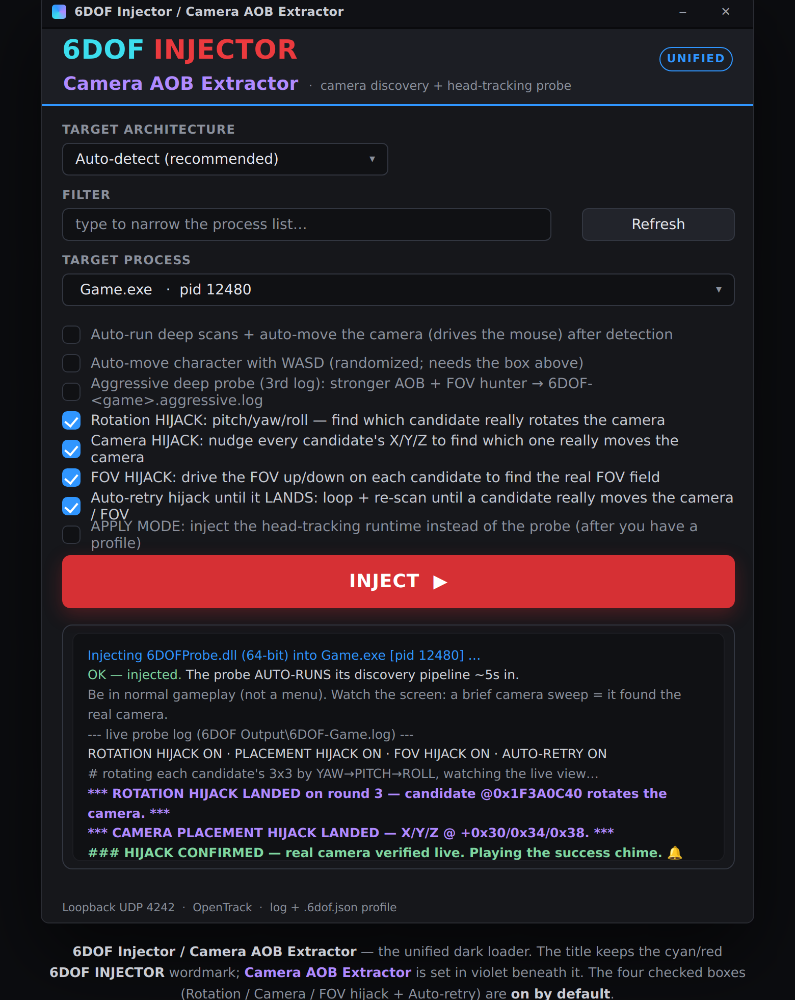

<h1 align="center">6DOF Injector / Camera AOB Extractor</h1>

  
  
  
  

---

## 📖 What it is

**6DOF Injector / Camera AOB Extractor** finds a game's camera in memory and writes down everything needed to
drive it for **6DOF head-tracking**. You inject a small probe into the running game; it locates the real camera, captures
the exact CPU instruction that writes it (the **AOB**), and — by default — **actively confirms** it on the live
game: it *hijacks* each candidate, **rotating** it (pitch/yaw/roll) and **nudging** its X/Y/Z to see which one
truly turns and moves the camera, and driving the **FOV** up/down to find the real FOV field — looping until it
lands. It then saves a human-readable log plus a machine-readable profile, and a separate runtime reads that
profile to apply your **OpenTrack** head pose (rotation, position, and FOV) to the camera.

It works across **D3D9 / 10 / 11 / 12, OpenGL and Vulkan**, in both **64-bit and 32-bit** games.

  

---

## 🚀 How to use

1. **Run the loader** — `6DOFInjectGUI.exe`. It's a single **unified** loader: it injects 64-bit games
   directly and hands 32-bit games to the bundled `6DOFInject32.exe`, so keep all the files together.
2. **Pick the target architecture** from the top dropdown — **Auto-detect** (recommended) figures it out for
   you; **64-bit** / **32-bit** force it.
3. **Pick the game** from the process dropdown (type in the filter box to narrow it down).
4. *(Optional)* tick **"Auto-run deep scans"** to chain the extra memory/differential passes automatically
   after the camera is found.
5. **The active hijacks + auto-retry are ON by default** — you don't need to touch them. **Four** boxes start
   **checked**, so the probe automatically *confirms* the real camera (rotation, placement and FOV) on the live game:
   - **Rotation HIJACK** *(default ON)* — rotates each candidate by pitch / yaw / roll and finds which one
     actually turns the rendered camera, proving the real orientation field (the core head-look axis).
   - **Camera HIJACK** *(default ON)* — nudges each candidate's X / Y / Z and finds which one actually moves
     the rendered camera (per axis), proving the real position field instead of guessing.
   - **FOV HIJACK** *(default ON)* — drives each FOV candidate up/down and finds which one really changes the
     rendered FOV (with its range + encoding), or concludes there's no separate FOV field.
   - **Auto-retry until it LANDS** *(default ON)* — loops and re-scans until a candidate *actually* moves the
     camera / changes the FOV, then logs the landing and plays the success chime.
   - **Aggressive deep probe** *(default OFF — opt-in)* — a harder-hitting pass (longer write-watch, more
     candidates, wider FOV hunt) that also writes a **third log**, `6DOF-<game>.aggressive.log`.

   Un-tick any of them to turn that behaviour off. *(A plain CLI injection — `6DOFInject.exe Game.exe` — keeps
   the hijacks + retry on too.)*

> 🔔 **About the success chime:** with the hijacks on (the default), the chime is **reserved for a real,
> confirmed hijack** — it plays the moment a rotation **or** placement hijack *lands* (the real camera proven live - rotation is the
> core head-look axis); FOV is reported alongside but doesn't block it. The plain "AOB captured" event stays silent. If the hijack genuinely
> can't self-verify (a Vulkan / pure-CPU title with no GPU view to test against) but a usable AOB was captured,
> the chime still plays as a clearly-logged **fallback**, so you always get a completion signal.
6. **Click INJECT**, then **be in normal gameplay** (not a menu) and **keep the camera moving** — see
   *How the capture works* below.
7. **Listen for the chime** 🔔 — a short beep jingle plays the moment the hijack **confirms the real camera**
   (or, as a fallback, when a usable AOB is captured on a title the hijack can't self-verify).
8. **Read the output** in the new **`6DOF Output`** folder (next to the loader).

> 💻 **CLI alternative:** `6DOFInject.exe Game.exe` (or a PID). Add `--runtime` to inject the runtime instead.

⌨️ **In-game keys:** `INSERT` re-run · `END` report now · `HOME` memory scan · `F7`/`F8` differential.

---

## 🎯 How the capture works

To pin down the camera, its values have to **change** — so the probe needs the camera moving. You have two
ways to provide that, and **you can mix them**:

### 🤖 The app moves the camera for you (auto-input)
With **Auto-run deep scans** on, the probe drives the game itself:

- 🖱️ **Auto-mouse** — injects mouse-look (spin, yaw, pitch sweeps) so the view rotates. A brief on-screen
  camera sweep right after injection means it found and is exercising the real camera.
- 🎮 **Auto-WASD** — injects `W/A/S/D` so the character also *moves* (needed to confirm the separate
  position field for full 6DOF, not just rotation).

Everything it injects is written to the log (e.g. `injected: mouse net dx=930 dy=0 ; key held=A`). Just
**focus the game window and stay in gameplay** while it runs.

### 🕹️ You move the camera yourself (manual input — also logged)
You don't have to rely on auto-input. If you'd rather look around by hand, the probe **recognises and logs
your own input** and uses it to drive the capture:

- **Mouse + keyboard** — your real mouse-look and `W/A/S/D` are detected (even when the game has captured the
  cursor) and shown as `MANUAL INPUT (player): mouse dx.. dy.. WASD=..`. The probe filters out its own
  injected input, so only *your* motion is counted.
- **Gamepad** — an XInput monitor reads your controller and correlates stick motion to the locked camera
  (`CONTROLLER input: Lstick.. Rstick..`).

If you're moving while it watches, it **extends the watch** so your input gets a full chance to trap the
writer. The completion banner reports how much manual input it saw.

### ⏱️ Two phases, and it runs for a while on purpose
**Phase 1 — locate.** The write-watch runs the **full ~30–40 seconds** (not a quick pass) so it can gather many
hits and **up to 5 ranked candidate writers** before deciding. **Keep moving the whole time** (the camera moving
is what lets the differential isolate it).

**Phase 2 — confirm (the hijacks).** Once candidates exist, the probe *writes* to each one to prove which is real:
it rotates it (pitch/yaw/roll), nudges its X/Y/Z, and drives its FOV up/down, watching the rendered view respond.
This part **perturbs the camera itself**, so it doesn't strictly need you to move — but staying in live gameplay
helps it catch the currently-rendered instance on engines that pool camera buffers. It **loops and re-scans until
it lands**, then plays the **notification chime** 🔔 the moment the camera is *confirmed* (a rotation or placement
hijack landing) and stops the auto-movement.

---

## 📂 What it outputs

Everything lands in a **`6DOF Output\`** subfolder beside the loader:

| File | What it is |
|------|------------|
| 📝 `6DOF-<game>.log` | **Main log** — the full, readable record of what was found and how. |
| 🎞️ `6DOF-<game>.perframe.log` | **Per-frame log** — a continuous, lighter trace of the live camera (position / FOV / draw counts) and the progress of the active hijack tests, frame by frame. |
| 🔥 `6DOF-<game>.aggressive.log` | **Aggressive log** *(only with the checkbox)* — the stronger AOB + FOV hunt and the full camera/FOV-hijack detail. |
| 🧩 `<game>.exe.6dof.json` | **Profile** — the same findings as compact machine data for the runtime. |

> The **HIJACK verdicts** (which candidate moved the camera per axis, which float is the real FOV) are mirrored
> into **all three logs** so they're impossible to miss.

### 📝 The log explained

The log is meant to be read top-to-bottom. The key sections:

- 🔎 **Fingerprint** — the detected engine, graphics API, and architecture.
- 🎥 **VIEW / PROJ** — the camera's view matrix (what head-tracking modifies) and the projection matrix
  (field of view, near/far, handedness, reversed-Z).
- 🕹️ **Auto-input / MANUAL INPUT / CONTROLLER** — exactly what motion drove the capture, injected and your own.
- 🧱 **CANDIDATE[0..4]** — up to **5 ranked writer candidates**, each with its module, hit count, decode,
  the **write FORM** (e.g. *"4 packed SSE stores"*, *"16 integer-mov elements field-by-field"*), and a
  confidence %.
- 🎯 **DIFFERENTIAL MOST-LIKELY AOB** — the single best candidate to hook first.
- 📍 **Locator / STRONG_AOB** — how to re-find the camera: the exact write instruction, the capture register
  and field offset, plus a **context-rich, wildcarded signature verified UNIQUE** in the module.
- 🔭 **FOV** — the FOV field (actively confirmed by a zoom test where possible) and its writer.
- 🧭 **REPRESENTATION** — how the rotation is stored (matrix / quaternion / euler / eye+target).
- 🎛️ **ROTATION / PLACEMENT / FOV HIJACK** — the active confirmation: each candidate's per-axis response
  (yaw/pitch/roll, X/Y/Z, FOV up/down) and which one actually drives the rendered camera, plus the
  `*** … LANDED ***` line when one is confirmed.
- 🏅 **CAPTURE QUALITY** — an honest verdict (`STRONG / GOOD / FAIR / WEAK`) of what was actually captured.
- 🔔 **HIJACK CONFIRMED** — printed with the chime once a rotation/placement hijack proves the real camera on the
  live game (or a clearly-logged **fallback** chime on a title the hijack can't self-verify).

### 🧩 The profile explained

`<game>.exe.6dof.json` is the log's findings in a fixed shape the runtime can load. Fields:

- ✅ **`verified`** — `true` once the camera passed the closed-loop "does the view respond" test.
- 📍 **`locator`** — `module`, `write_aob`, `capture_register`, `field_offset`, the stolen bytes, the
  **`strong_aob`** (+`strong_aob_unique`), and function-entry / CPU-offset backups.
- 🧱 **`candidates`** + **`differential_most_likely`** — the top-5 ranked writers with decode, `write_form`,
  `matrix_write` and `confidence`.
- 🧭 **`representation`** — `kind` and the offset of each field, `axis_roles` for euler, and the `fov` offset.
- 🎚️ **`apply`** — drive settings: `position_scale_*`, `look_sensitivity`, `smoothing`, `clamp_deg`,
  `head_cm_to_world`, `roll_enable`, `udp_port`, per-axis **`invert_*`** flags, and the **FOV** controls
  (`fov_mode`, `fov_target_deg`, `fov_scale`, `fov_step_deg`, `fov_base_deg`, `fov_clamp`).
- 🔭 **`projection_convention`** — `handedness`, `reversed_z`, `infinite_far`.

---

## 🎮 Driving head-tracking (runtime)

Put `6DOFRuntime.dll` (use `6DOFRuntime32.dll` for a 32-bit game) and the `<game>.exe.6dof.json` next to the
game and inject the runtime. It loads the profile, runs a cave **self-test**, re-finds the camera, reads
**OpenTrack** on `127.0.0.1:4242`, and applies your head pose (matrix, euler, quaternion, or separate
position — whatever was captured).

### 🔭 FOV control (static / scale)

If the probe found the FOV field, the runtime can also **drive it** — useful to widen the view for comfort or
to lock a fixed FOV. Set it in the profile's `apply` block, or toggle it live:

- **`fov_mode`** — `"off"` (default), `"static"` (force a fixed angle), or `"scale"` (multiply the engine's own FOV).
- **`fov_target_deg`** — the absolute horizontal FOV to force in static mode (e.g. `100`). If `0`, static falls back to `fov_scale`.
- **`fov_scale`** — multiplier on the game's live FOV (e.g. `1.15` for a touch wider); tracks the engine when it zooms/ADS.
- **`fov_clamp`** `[min,max]` — degrees; the result is clamped to this band.
- **`fov_base_deg`** — only used when the field stores FOV as a *factor of a base FOV* (the runtime auto-detects the
  field's encoding — degrees / radians / factor — from the probe's sampled value).

Everything is specified in **degrees**; the runtime converts to whatever the field actually stores.

⌨️ **Runtime keys:** `F8` toggle tracking · `F9` recenter · `F10` invert yaw · `F11` invert pitch · `F6` toggle FOV override · `F5`/`F7` narrow/widen FOV.

---

## 🛠️ Build from source

Needs `mingw-w64`. Run `./build.sh` to build everything: the probe (x64 + x86), the runtime (x64 + x86),
the CLI injector (x64 + x86), and the single unified GUI (x64).

| Target | Toolchain |
|--------|-----------|
| x64 | `x86_64-w64-mingw32-g++` |
| x86 | `i686-w64-mingw32-g++` |

---

## 📦 What's in the package (7 files)

| File | Purpose |
|------|---------|
| `6DOFInjectGUI.exe` | Unified dark-theme loader (handles 32- and 64-bit targets) |
| `6DOFInject.exe` / `6DOFInject32.exe` | CLI injectors (64 / 32-bit) |
| `6DOFProbe.dll` / `6DOFProbe32.dll` | The probe that finds + captures the camera (64 / 32-bit) |
| `6DOFRuntime.dll` / `6DOFRuntime32.dll` | Applies OpenTrack head pose from a profile (64 / 32-bit) |

> ⚠️ Keep all files together — the GUI calls the matching-arch CLI for cross-architecture targets.
